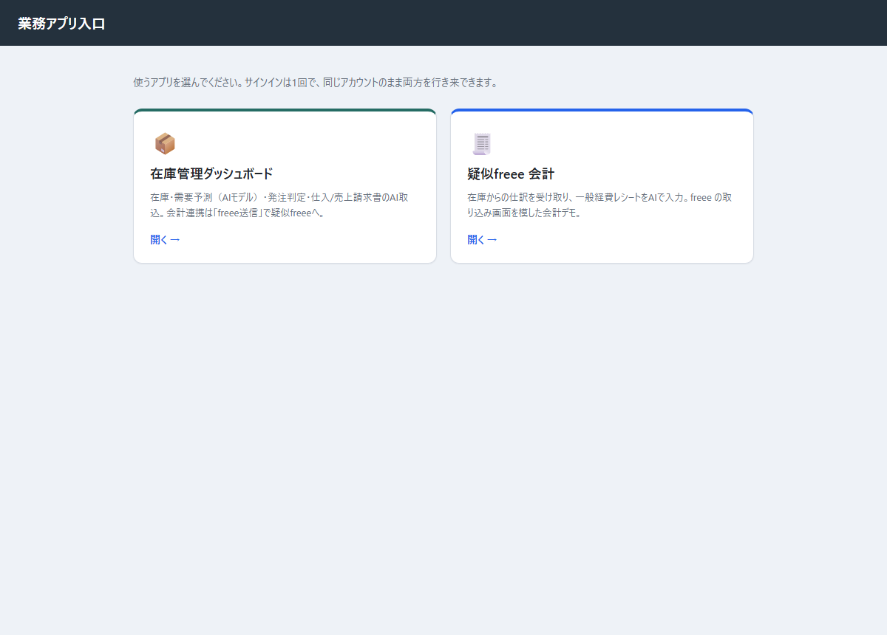
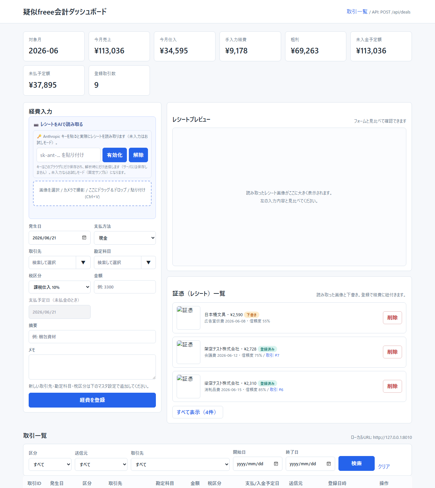
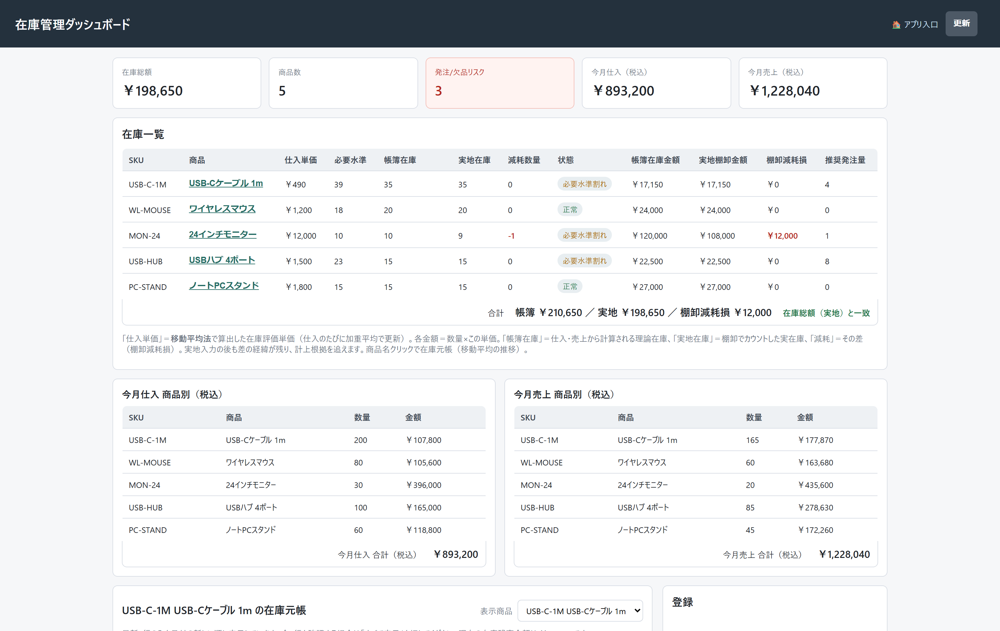
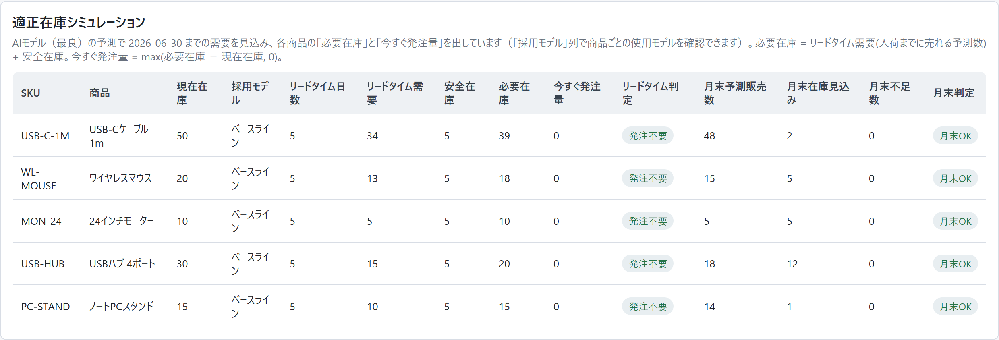

# 在庫管理 × 需要予測 × AI証憑入力 ×（疑似）freee会計 連携スイート

小規模EC・中小企業の仕入担当者／経理担当者を想定した業務アプリ **2本立て**です。
**在庫管理＋AI需要予測＋AI証憑入力**の「**在庫ダッシュボード**」と、その仕訳を受け取って記帳する
「**疑似freee 会計**」を、**1つのログイン（Clerk）で選んで行き来**できます。
仕入・売上の登録 → 適正在庫の判断 → 「freee送信」→ 疑似freee で記帳・レシートのAI入力、までを一気通貫でデモできます。

## 🚀 ライブデモ

**👉 入口（アプリ選択）: https://inventory-dashboard-61w8.onrender.com/launcher**

サインイン（Clerk）すると、入口ページで2つのアプリをカードから選べます。

| アプリ | URL | 内容 |
|---|---|---|
| 📦 在庫ダッシュボード | https://inventory-dashboard-61w8.onrender.com | 在庫・需要予測・発注判定・仕入/売上請求書のAI取込 |
| 🧾 疑似freee 会計 | https://pseudo-freee.onrender.com | 在庫からの仕訳受け取り・経費レシートのAI入力（freee の取込画面を模した会計デモ） |

- サインイン後、**専用のデモデータ（商品・2年分の販売履歴）が自動投入**され、すぐ触れます。
- 無料ホスティング（Render）のため、**初回アクセスは起動に30〜60秒**かかることがあります（スリープ復帰）。
- レシート/請求書の**AI読み取り**は既定では無料のサンプル動作。本物のAIで試すには、画面の「AI設定」欄に
  **自分のAnthropic APIキー**を貼ると有効になります（両アプリ対応 → [各自APIキー方式](#-各自apiキー方式byo-key)）。

## 📸 スクリーンショット

| 入口ページ（統一ログイン後のアプリ選択） | 疑似freee 会計（レシートAI入力・BYO-key・KPI） |
|---|---|
|  |  |

| 在庫ダッシュボード | 適正在庫シミュレーション（AI予測） |
|---|---|
|  |  |

> 全画面版は [`docs/screenshots/`](docs/screenshots/) にあります。

## ✨ 主な機能

| 機能 | 内容 |
|---|---|
| 統一ログイン＋アプリ選択 | **1つの Clerk ログイン**で「在庫」「疑似freee」を入口ページ（/launcher）から選択・行き来 |
| 在庫管理 | 商品/取引先マスタ・仕入/売上登録・商品別在庫元帳・取消/訂正履歴 |
| 適正在庫シミュレーション | 現在在庫・必要在庫・今すぐ発注量・月末判定を一覧表示（**AI予測ベース**） |
| 需要予測（レベル2） | 3モデル（ベースライン/SARIMA/LightGBM）を**バックテスト(MAE/MAPE)で比較し、商品ごとに最良モデルを自動採用**。実績線＋予測線＋信頼区間(80%)をグラフ表示 |
| AI証憑入力 | 請求書/レシート画像 → Claude vision が下書き → 人が確認して登録（**自動登録はしない**）。在庫＝仕入/売上請求書、疑似freee＝経費レシート |
| freee連携（一気通貫） | 在庫の仕入/売上を「送信」→ 疑似freee が会計取引として受け取り・一覧表示（**二重送信防止**つき） |
| マルチテナント認証 | Clerk による組織単位のデータ分離（他テナントのデータは見えない設計） |

## 🛠 技術スタック

| 領域 | 採用技術 |
|---|---|
| 言語 / フレームワーク | Python 3.11。在庫＝**FastAPI + Uvicorn**／疑似freee＝**標準ライブラリ http.server**（依存最小） |
| データベース | **Neon (PostgreSQL)**。2アプリは**別データベースで分離**。ローカルは SQLite（`DATABASE_URL` で自動切替） |
| 認証 | **Clerk**（JWT を JWKS(RS256) で検証・マルチテナント・**両アプリで同一インスタンス＝統一ログイン**） |
| 画像ストレージ | **Cloudflare R2**（S3互換）。共有バケットを**キー接頭辞で分離**。未設定時はローカルフォルダ（`STORAGE_*` で切替） |
| AI（証憑読み取り） | **Anthropic Claude**（vision・structured outputs・**BYO-key**） |
| 需要予測 | pandas / NumPy / scikit-learn / **LightGBM** / statsmodels(SARIMA) |
| ホスティング | **Render**（Blueprint `render.yaml`・**2サービス**） |

## 🧩 アーキテクチャ

```text
                 ┌─────────────────────────────┐
                 │  ブラウザ（仕入/経理担当）     │
                 └──────────────┬──────────────┘
                      Clerk で1回サインイン
                                ▼
                  ┌───────────────────────────┐
                  │   入口ページ  /launcher     │  ← 2アプリを選択
                  └───────┬──────────────┬─────┘
                          ▼              ▼
        ┌──────────────────────┐  ┌──────────────────────┐
        │ 在庫アプリ (FastAPI)   │─▶│ 疑似freee (http.server) │  ← freee送信で仕訳連携
        │ 在庫 / 予測 / AI証憑   │  │ 会計記帳 / レシートAI入力 │
        └───────┬──────┬───────┘  └───────┬──────┬───────┘
                ▼      ▼                  ▼      ▼
              Neon    R2                Neon    R2      （＋ Anthropic Claude ＝各自キーで都度）
            台帳DB  証憑画像           台帳DB  証憑画像
           （在庫用）                  （freee用＝在庫とは別DB）
```

役割が違う外部サービス（台帳=Neon／倉庫=R2／認証=Clerk／AI=Claude）を、それぞれ環境変数で差し替え可能に設計。
2アプリは**別DBでデータを分離**しつつ、**同一 Clerk で統一ログイン**。データ（Neon）・画像（R2）は外部に持つため、
無料ホスティングの**コンテナが再起動してもデータは消えません**。

## 🔑 各自APIキー方式（BYO-key）

公開デモでも**運営者のAI利用料が増えない**よう、AIキーは利用者が持ち込む方式にしています（**両アプリ対応**）。

- 既定は**AIオフ＝決定的なサンプル動作**（誰でも無料で一通り試せる）。
- 利用者が画面で**自分のAnthropicキーを貼る**と本物のAI解析が有効になる。
- そのキーは**ブラウザにのみ保存**し、解析の**都度だけサーバへ送信**、**サーバ・DB・ログには一切保存しない**。

設計の核は `inventory_dashboard/ai_capture.py` と `pseudo_freee/ai_capture.py`（どちらもリクエスト毎にキーを受け取り、無ければスタブにフォールバック）。

## 💻 ローカルでの動かし方

```bash
git clone https://github.com/87yoko-ai-engineer/inventory-freee-portfolio.git
cd inventory-freee-portfolio
python -m venv .venv
# Windows: .venv\Scripts\activate   /   Mac・Linux: source .venv/bin/activate
pip install -r requirements.txt

# 環境変数（任意。未設定でも SQLite + 開発ログイン + スタブAI で動く）
cp .env.example .env   # Windows: Copy-Item .env.example .env

# 在庫アプリ
cd inventory_dashboard && python app.py    # → http://127.0.0.1:8000
# 別ターミナルで疑似freee
cd pseudo_freee && python app.py           # → http://127.0.0.1:8010
```

- `DATABASE_URL` 未設定なら **SQLite**、`AUTH_DEV_MODE=true` なら Clerk 無しの**開発ログイン**で両アプリが動きます。
- テスト: `pytest`（`inventory_dashboard/` と `pseudo_freee/` の各配下。SQLite で実行）。

## 📌 補足・既知の制約

- Clerk は **開発インスタンス**（テストキー）を利用しています（本番インスタンスは独自ドメインが必要なため将来対応）。
- 「統一ログイン」はサブドメインを跨ぐため、Clerk 開発キーの仕様上まれに再サインインを求めることがあります（**同じアカウントで入り直すだけ**）。
- Render 無料枠のため、15分アクセスが無いとスリープ → 次アクセスで数十秒の起動待ちが発生します。

## 📚 ドキュメント

| 資料 | 内容 |
|---|---|
| [`docs/EVOLUTION_PLAN.md`](docs/EVOLUTION_PLAN.md) | 開発計画・採用スタックの検討記録 |
| [`docs/PSEUDO_FREEE_REQUIREMENTS.md`](docs/PSEUDO_FREEE_REQUIREMENTS.md) | 疑似freee の機能要件定義 |
| [`docs/PSEUDO_FREEE_PERSISTENCE_REQUIREMENTS.md`](docs/PSEUDO_FREEE_PERSISTENCE_REQUIREMENTS.md) | 疑似freee 永続化（Neon＋R2）の要件定義 |
| [`docs/FREEE_INTEGRATION_PLAN.md`](docs/FREEE_INTEGRATION_PLAN.md) | freee連携の設計 |
| [`ARCHITECTURE.md`](ARCHITECTURE.md) | 構成メモ |
| [`inventory_dashboard/ROADMAP.md`](inventory_dashboard/ROADMAP.md) | 機能ロードマップ |
