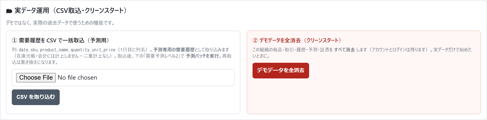
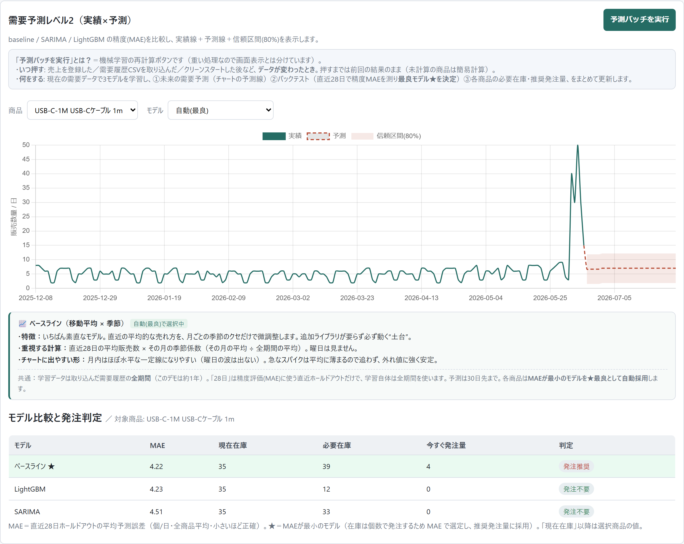
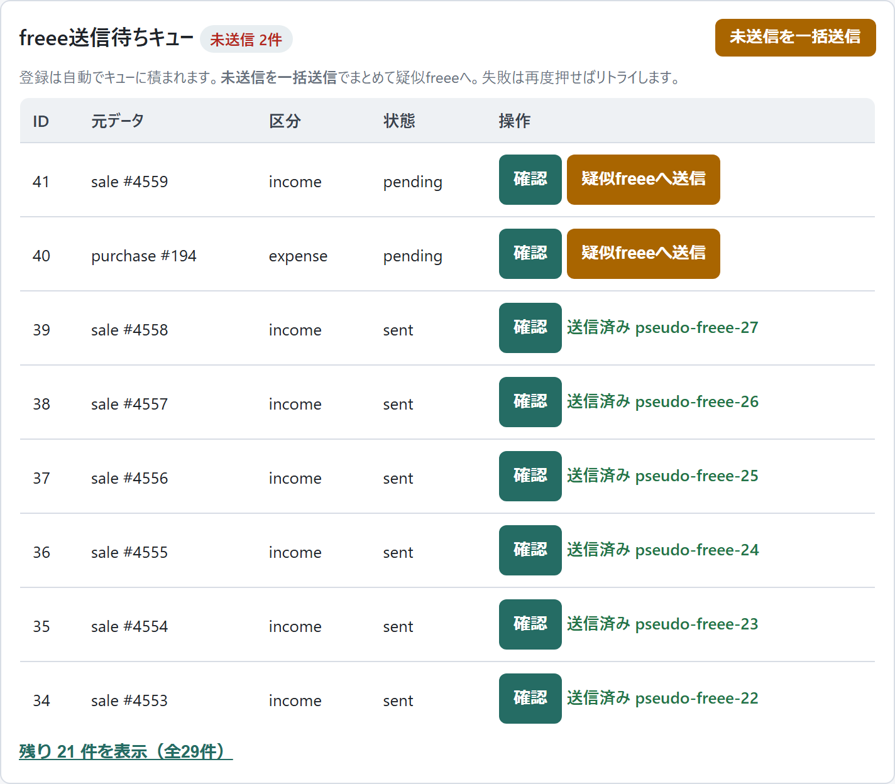
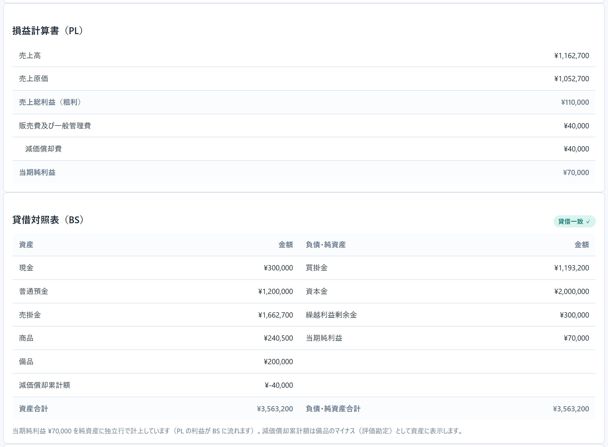
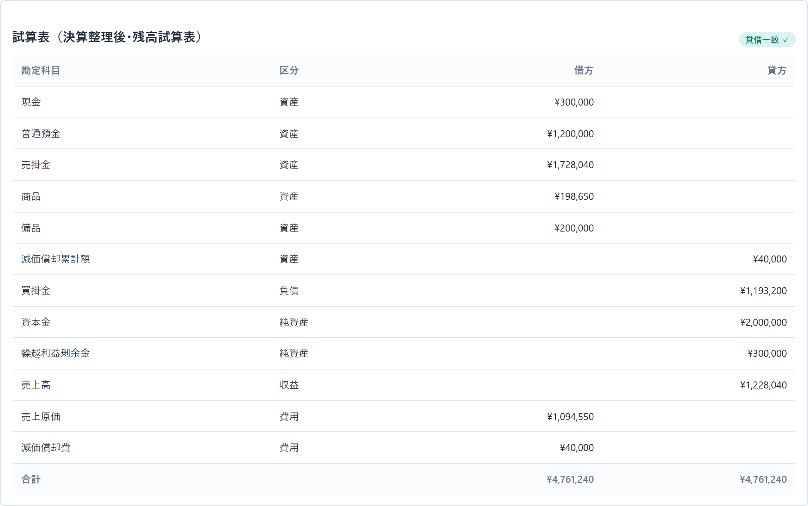
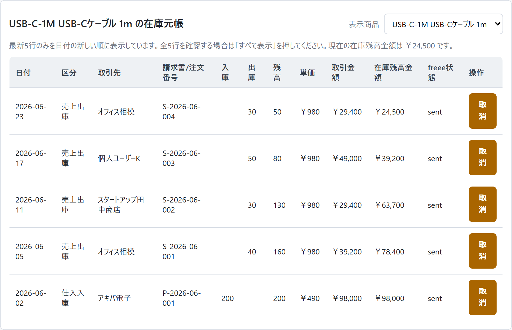

# 在庫管理 × 需要予測 × AI証憑入力 ×（疑似）freee会計 連携スイート

小規模EC・中小企業の仕入担当者／経理担当者を想定した業務アプリ **2本立て**です。
**在庫管理＋AI需要予測＋AI証憑入力**の「**在庫ダッシュボード**」と、その仕訳を受け取って記帳する
「**疑似freee 会計**」を、**1つのログイン（Clerk）で選んで行き来**できます。
仕入・売上の登録 → 適正在庫の判断 → 「freee送信」→ 疑似freee で記帳・レシートのAI入力、までを一気通貫でデモできます。
**在庫と会計（疑似freee）が常に一致**するよう、確実な送信（一括／リトライ）・取消の同期・期末棚卸連携・**会計突合ビュー**まで備えています。

## 🚀 ライブデモ

**👉 入口（アプリ選択）: https://inventory-dashboard-61w8.onrender.com/launcher**

サインイン（Clerk）すると、入口ページで2つのアプリをカードから選べます。

> 🔑 **はじめての方へ（ログイン方法）**：サインイン画面で **Sign up（新規登録）** を選び、
> **お手持ちのメールアドレス**か **Google アカウント**で登録してください。登録すると
> **あなた専用のデモデータ（商品・2年分の販売履歴）が自動投入**され、すぐに触れます。
> データは**利用者ごとに分離**されるため、他の人のデータは見えません（マルチテナント設計）。

| アプリ | URL | 内容 |
|---|---|---|
| 📦 在庫ダッシュボード | https://inventory-dashboard-61w8.onrender.com | 在庫・需要予測・発注判定・仕入/売上請求書のAI取込 |
| 🧾 疑似freee 会計 | https://pseudo-freee.onrender.com | 在庫からの仕訳受け取り・経費レシートのAI入力（freee の取込画面を模した会計デモ） |

- サインイン後、**専用のデモデータ（商品・2年分の販売履歴）が自動投入**され、すぐ触れます。
- 無料ホスティング（Render）のため、**初回アクセスは起動に30〜60秒**かかることがあります（スリープ復帰）。
- レシート/請求書の**AI読み取り**は既定では無料のサンプル動作。本物のAIで試すには、画面の「AI設定」欄に
  **自分のAnthropic APIキー**を貼ると有効になります（両アプリ対応 → [各自APIキー方式](#-各自apiキー方式byo-key)）。

## 📸 スクリーンショット

| 入口ページ（統一ログイン後のアプリ選択） | 疑似freee 会計（レシートAI入力・BYO-key・KPI） |
|---|---|
|  |  |

| 在庫ダッシュボード | 適正在庫シミュレーション（AI予測） |
|---|---|
|  |  |

**実データ運用（過去売上CSVの一括取込・デモ全消去でクリーンスタート → 実データで需要予測）**



**Phase D（在庫⇄会計の連携・複式簿記）**

| 🔗 会計突合（在庫⇄疑似freee が一致） | 📈 モデル比較と発注判定（3モデル・MAE順・★最良） |
|---|---|
|  |  |

| 📤 確実な送信（未送信バッジ＋一括送信・Outbox） | 📦 期末棚卸の連携（在庫評価額 → freee 期末商品） |
|---|---|
|  |  |

**📊 決算書＋売上原価の計算過程（三分法・棚卸減耗損）— 実地棚卸で帳簿と差があれば棚卸減耗損（¥12,000）を計上し、三分法で実地ベースの売上原価（¥1,094,550）を導出。その売上原価がそのまま損益計算書(PL)に反映され、貸借対照表(BS)は貸借一致**



| 🧮 試算表（決算整理後・残高試算表／貸借一致） | 📒 在庫元帳に棚卸減耗を計上（帳簿10→実地9・¥12,000） |
|---|---|
|  |  |

> 📒 在庫元帳では実地棚卸の減耗を **区分「棚卸減耗」として1行**で計上し、数量・単価・在庫残高金額の変化として記録します（数字を後から追える監査証跡）。この在庫側の減耗が、決算では棚卸減耗損として売上原価に算入されます。

> 全画面版は [`docs/screenshots/`](docs/screenshots/) にあります。発注点を下回ると在庫一覧に「必要水準割れ」と推奨発注量が表示されます（[dashboard-overview](docs/screenshots/dashboard-overview.png)）。

## ✨ 主な機能

| 機能 | 内容 |
|---|---|
| 統一ログイン＋アプリ選択 | **1つの Clerk ログイン**で「在庫」「疑似freee」を入口ページ（/launcher）から選択・行き来 |
| 在庫管理 | 商品/取引先マスタ・仕入/売上登録・商品別在庫元帳・取消/訂正履歴。取引先は**在庫⇄会計を共有IDで連携**（在庫で改名すると、送信済みの会計取引の取引先名も一括更新） |
| 適正在庫シミュレーション | 現在在庫・必要在庫・今すぐ発注量・月末判定を一覧表示（**AI予測ベース**。採用モデルを切り替えると一覧・シミュにも即反映＝探索モード）。在庫が**必要水準を下回ると「必要水準割れ」と推奨発注量**を表示し、仕入担当者に発注を促す |
| 需要予測（レベル2） | 3モデル（ベースライン/SARIMA/LightGBM）を**バックテスト(MAE)で比較し、商品ごとに最良モデルを自動採用**。実績線＋予測線＋信頼区間(80%)をグラフ表示。**「モデル比較と発注判定」表**で3モデルの必要在庫・発注量・判定を一括比較（★最良・MAE昇順） |
| 需要履歴の分離（予測専用） | 過去売上CSVは**予測専用テーブル（`demand_history`）**へ取り込み、実取引台帳・会計には流さない設計。**台帳を汚さず**長期の日次履歴で予測精度を上げられる（実取引と需要シミュレーションを概念分離） |
| AI証憑入力 | 請求書/レシート画像 → Claude vision が下書き → 人が確認して登録（**自動登録はしない**）。在庫＝仕入/売上請求書、疑似freee＝経費レシート |
| freee連携（一気通貫・確実な送信） | 在庫の仕入/売上を「送信」→ 疑似freee が会計取引として受け取り・一覧表示（**二重送信防止**つき）。**未送信N件バッジ＋ワンクリック一括送信＋失敗の自動リトライ**（教科書的な Outbox パターン）で送り忘れ・乖離を防止 |
| 取消の同期（reverse-and-repost） | 送信済みの仕入/売上を在庫で取り消すと、**符号反転した「取消仕訳」**を送信待ちに自動投入。送信すると疑似freee 側で元仕訳を相殺（元仕訳＋取消仕訳の両方を監査証跡として保持） |
| 会計突合（リコンサイル） | 在庫の**売上合計・仕入合計・期末在庫**と疑似freee の**売上高・仕入高・商品**をAPIで照合し、一致＝✓／不一致＝差分を表示。「在庫と会計が常に一致している」ことを画面で証明（`/api/reconciliation`） |
| 期末棚卸・棚卸減耗 | 在庫の**期末評価額（Σ 在庫数 × 仕入単価）**を疑似freee の**期末商品棚卸高**へ送信し、**三分法の売上原価（期首＋当期仕入−期末）**とBSの商品残高に反映。実地棚卸を**商品ごとに記録**して在庫を評価減でき、帳簿と実地の差は**棚卸減耗損**として計上され、売上原価に算入（在庫ダッシュボード・突合・疑似freee の BS/PL が実地額で一致） |
| 在庫評価（移動平均法） | 在庫評価は**移動平均法**（仕入のたびに加重平均で単価を更新）。在庫一覧に**仕入単価（移動平均）**列を表示し、**数量 × 単価 = 金額**の根拠を明示。在庫元帳でも移動平均単価の推移を表示 |
| 棚卸の監査証跡（トレーサビリティ） | 在庫一覧に**帳簿在庫／実地在庫／減耗数量**と**帳簿在庫金額／実地棚卸金額／棚卸減耗損**を列表示し、実地入力後も**計上根拠を追える**ようにする（「適当に数字を合わせる」不正の抑止）。期末在庫の**freee 送信履歴**（送信日時・対象期・帳簿/実地/棚卸減耗損）を保存・表示し、在庫一覧との照合チェック表になる |
| 複式簿記・決算（疑似freee） | 取引を**借方/貸方の仕訳に自動展開**し、**試算表・貸借対照表(BS)・損益計算書(PL)・仕訳帳・総勘定元帳**を表示（税込経理）。**三分法**で売上原価（期首商品＋当期仕入−期末商品）を計算。**対応範囲は商業簿記の基本的な記帳・決算まで**（工業簿記・製造原価計算〔簿記2級相当〕、連結会計・外貨建取引〔簿記1級相当〕は対象外） |
| マルチテナント認証 | Clerk による組織単位のデータ分離（他テナントのデータは見えない設計） |

## 📈 需要予測の3モデル（特徴・計算ロジック・チャートの形）

「自動(最良)」では、商品ごとに**バックテストの精度(MAE)が最小のモデルを自動採用**します。3つは考え方が違うので、チャートの形にも素直に違いが出ます（**同じ説明をアプリのチャート下にも表示**しているので、モデルを切り替えると「なぜこの形か」を読みながら確認できます）。

| モデル | 特徴 | 重視する計算（ロジック） | チャートに出やすい形 |
|---|---|---|---|
| **ベースライン**（移動平均×季節） | いちばん素直。追加ライブラリ不要で必ず動く“土台” | 直近28日の平均販売数 × その月の季節係数（その月の平均 ÷ 全期間平均）。曜日は見ない | 月内はほぼ**水平な一定線**。スパイクは平均に薄まり追わない＝外れ値に強く安定 |
| **SARIMA**（古典的な時系列） | 統計学の王道。自己回帰＋週周期を数式で捉える（収束しなければ Holt-Winters に自動退避） | 直前の値の流れ ＋ 差分(トレンド) ＋ 週次季節(7日)。直近の水準・傾きを引き継ぐ | **なめらかな曲線**で、平日が高く週末が低い“週の波” |
| **LightGBM**（機械学習・勾配ブースティング） | 非線形・多要因を学習できる主役。中央値＋80%区間を分位点回帰で直接予測 | カレンダー(曜日・月) ＋ 過去の値(ラグ) ＋ 外部要因 を決定木で非線形に学習し、1日ずつ再帰予測 | 学習した曜日・ラグを反映して**ギザギザ・不規則**。直近に敏感で、直近が0続きだと中央値が0付近に沈むことも |

**学習データと期間**：学習は取り込んだ需要履歴の**全期間**（このデモは約1年＝2025-06〜2026-06）を使います。「**直近28日**」は精度評価(MAE)に使うホールドアウト区間**だけ**で、学習自体は全期間が対象です。予測は**30日先**まで。MAE＝直近28日の平均絶対誤差（個/日・小さいほど正確）で、これが最小のモデルを商品ごとに**★最良**として自動採用します。

> 💡 **チャートの形の裏づけ（例）**：このデモのUSB-Cは**ベースライン**がMAE最小で★最良。予測線は履歴と同水準（約7/日）の水平線になります。手動で**LightGBM**を選ぶと、デモの需要履歴が5月末で終わり6月が疎（実取引だけが点在）なため予測が一時的に低めに沈みます——これは当てずっぽうではなく、「**直近の連続データに敏感**」というLightGBMの素直な反応が見えている例です。

## 🛠 技術スタック

| 領域 | 採用技術 |
|---|---|
| 言語 / フレームワーク | Python 3.11。在庫＝**FastAPI + Uvicorn**／疑似freee＝**標準ライブラリ http.server**（依存最小） |
| データベース | **Neon (PostgreSQL)**。2アプリは**別データベースで分離**。ローカルは SQLite（`DATABASE_URL` で自動切替） |
| 認証 | **Clerk**（JWT を JWKS(RS256) で検証・マルチテナント・**両アプリで同一インスタンス＝統一ログイン**） |
| 画像ストレージ | **Cloudflare R2**（S3互換）。共有バケットを**キー接頭辞で分離**。未設定時はローカルフォルダ（`STORAGE_*` で切替） |
| AI（証憑読み取り） | **Anthropic Claude**（vision・structured outputs・**BYO-key**） |
| 需要予測 | pandas / NumPy / scikit-learn / **LightGBM** / statsmodels(SARIMA) |
| ホスティング | **Render**（Blueprint `render.yaml`・**2サービス**） |

## 🧩 アーキテクチャ

```text
                 ┌─────────────────────────────┐
                 │  ブラウザ（仕入/経理担当）     │
                 └──────────────┬──────────────┘
                      Clerk で1回サインイン
                                ▼
                  ┌───────────────────────────┐
                  │   入口ページ  /launcher     │  ← 2アプリを選択
                  └───────┬──────────────┬─────┘
                          ▼              ▼
        ┌──────────────────────┐  ┌──────────────────────┐
        │ 在庫アプリ (FastAPI)   │─▶│ 疑似freee (http.server) │  ← freee送信で仕訳連携
        │ 在庫 / 予測 / AI証憑   │  │ 会計記帳 / レシートAI入力 │
        └───────┬──────┬───────┘  └───────┬──────┬───────┘
                ▼      ▼                  ▼      ▼
              Neon    R2                Neon    R2      （＋ Anthropic Claude ＝各自キーで都度）
            台帳DB  証憑画像           台帳DB  証憑画像
           （在庫用）                  （freee用＝在庫とは別DB）
```

役割が違う外部サービス（台帳=Neon／倉庫=R2／認証=Clerk／AI=Claude）を、それぞれ環境変数で差し替え可能に設計。
2アプリは**別DBでデータを分離**しつつ、**同一 Clerk で統一ログイン**。データ（Neon）・画像（R2）は外部に持つため、
無料ホスティングの**コンテナが再起動してもデータは消えません**。

## 🔑 各自APIキー方式（BYO-key）

公開デモでも**運営者のAI利用料が増えない**よう、AIキーは利用者が持ち込む方式にしています（**両アプリ対応**）。

- 既定は**AIオフ＝決定的なサンプル動作**（誰でも無料で一通り試せる）。
- 利用者が画面で**自分のAnthropicキーを貼る**と本物のAI解析が有効になる。
- そのキーは**ブラウザにのみ保存**し、解析の**都度だけサーバへ送信**、**サーバ・DB・ログには一切保存しない**。

設計の核は `inventory_dashboard/ai_capture.py` と `pseudo_freee/ai_capture.py`（どちらもリクエスト毎にキーを受け取り、無ければスタブにフォールバック）。

## 💻 ローカルでの動かし方

```bash
git clone https://github.com/shidareyanagi-ai-coding/inventory-freee-portfolio.git
cd inventory-freee-portfolio
python -m venv .venv
# Windows: .venv\Scripts\activate   /   Mac・Linux: source .venv/bin/activate
pip install -r requirements.txt

# 環境変数（任意。未設定でも SQLite + 開発ログイン + スタブAI で動く）
cp .env.example .env   # Windows: Copy-Item .env.example .env

# 在庫アプリ
cd inventory_dashboard && python app.py    # → http://127.0.0.1:8000
# 別ターミナルで疑似freee
cd pseudo_freee && python app.py           # → http://127.0.0.1:8010
```

- `DATABASE_URL` 未設定なら **SQLite**、`AUTH_DEV_MODE=true` なら Clerk 無しの**開発ログイン**で両アプリが動きます。
- テスト: `pytest`（`inventory_dashboard/` と `pseudo_freee/` の各配下。SQLite で実行）。

## 📌 補足・既知の制約

- Clerk は **開発インスタンス**（テストキー）を利用しています（本番インスタンスは独自ドメインが必要なため将来対応）。
- 「統一ログイン」はサブドメインを跨ぐため、Clerk 開発キーの仕様上まれに再サインインを求めることがあります（**同じアカウントで入り直すだけ**）。
- Render 無料枠のため、15分アクセスが無いとスリープ → 次アクセスで数十秒の起動待ちが発生します。

## 📚 ドキュメント

| 資料 | 内容 |
|---|---|
| [`docs/EVOLUTION_PLAN.md`](docs/EVOLUTION_PLAN.md) | 開発計画・採用スタックの検討記録 |
| [`docs/PSEUDO_FREEE_REQUIREMENTS.md`](docs/PSEUDO_FREEE_REQUIREMENTS.md) | 疑似freee の機能要件定義 |
| [`docs/PSEUDO_FREEE_PERSISTENCE_REQUIREMENTS.md`](docs/PSEUDO_FREEE_PERSISTENCE_REQUIREMENTS.md) | 疑似freee 永続化（Neon＋R2）の要件定義 |
| [`docs/FREEE_INTEGRATION_PLAN.md`](docs/FREEE_INTEGRATION_PLAN.md) | freee連携の設計 |
| [`docs/DOUBLE_ENTRY_BOOKKEEPING_PLAN.md`](docs/DOUBLE_ENTRY_BOOKKEEPING_PLAN.md) | 複式簿記・決算＋在庫⇄会計連携（Phase A〜D：突合・期末棚卸・取引先共有ID・確実な送信）の設計・実装記録 |
| [`ARCHITECTURE.md`](ARCHITECTURE.md) | 構成メモ |
| [`inventory_dashboard/ROADMAP.md`](inventory_dashboard/ROADMAP.md) | 機能ロードマップ |
